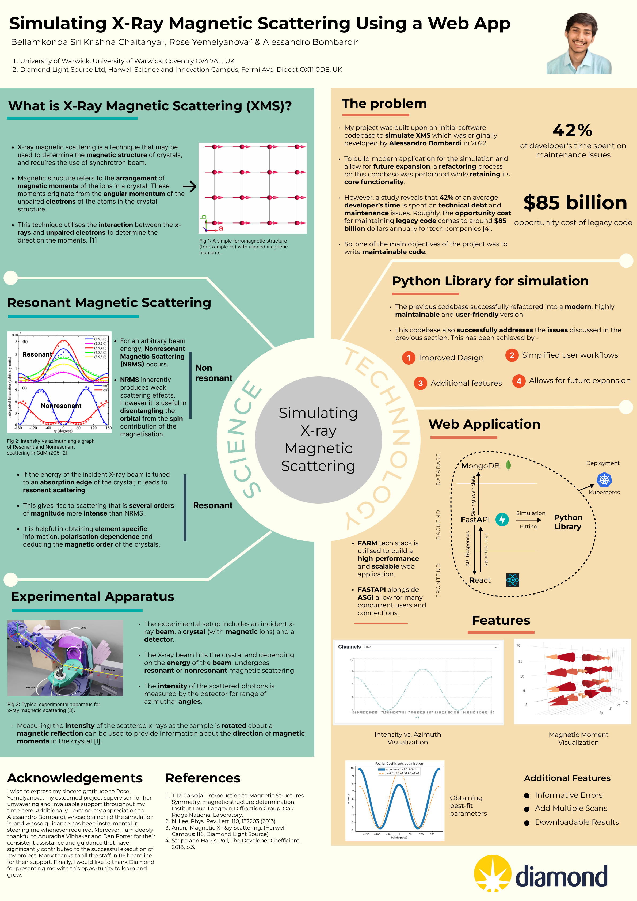

# Diamond Placement

### Description
Imagine conducting an experiment virtually, where you can analyse data and find the best possible match for your observations. A week ago I completed my summer placement at Diamond Light Source synchrotron, and this was exactly my project.

During my time here, I developed a modern website that simulates X-ray Magnetic Scattering building upon the work of Dr. Alessandro Bombardi. The application also includes data analysis tools that can help in finding the best-fit parameters for experimental observations.

I had the chance to work alongside domain experts in a real-world scientific environment and the experience has been invaluable. The project was a fine blend between science and technology which made it a thoroughly fulfilling venture.

Many thanks to my supervisor Rose Yemelyanova and Alessandro Bombardi for their constant support throughout my placement. Special mention also for the I16 beamline team at Diamond for guiding me through this journey.

I’m eager to continue exploring the intersection of science and technology in my future endeavours.

### Academic Poster

### Web application photos

